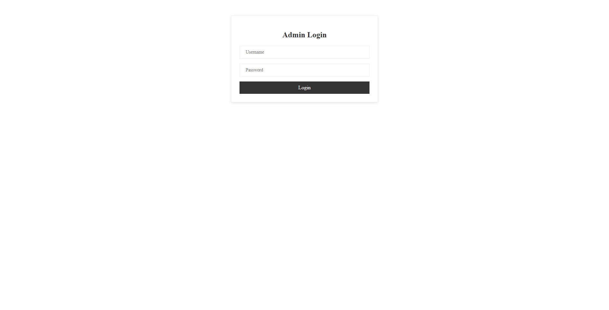
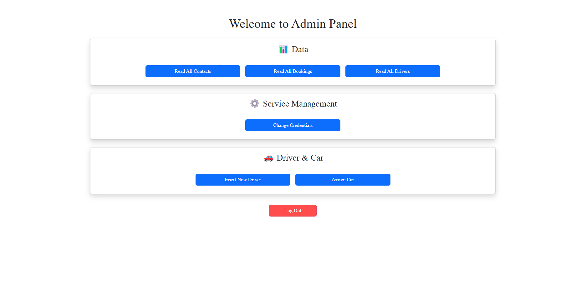
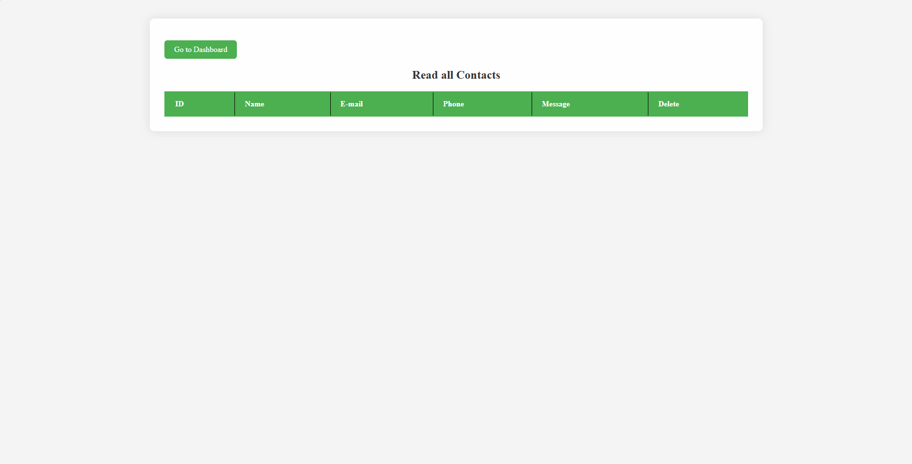
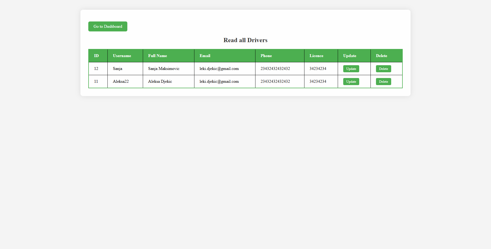
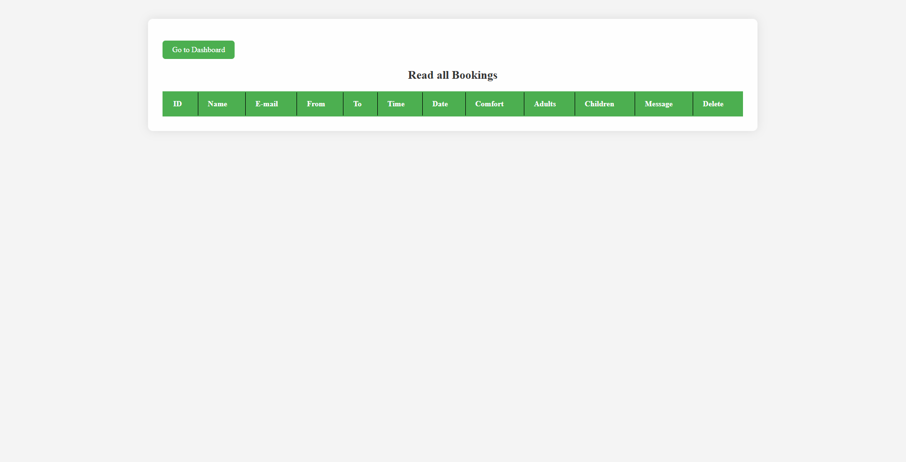
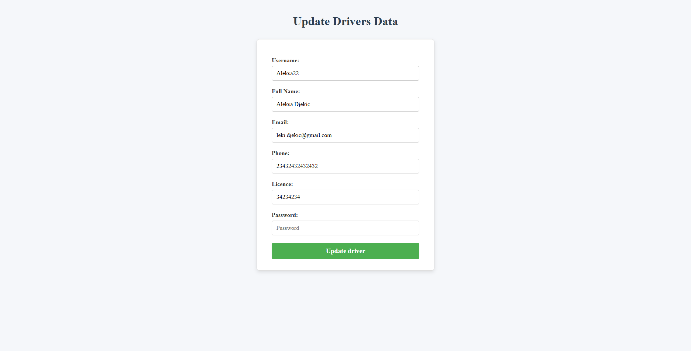
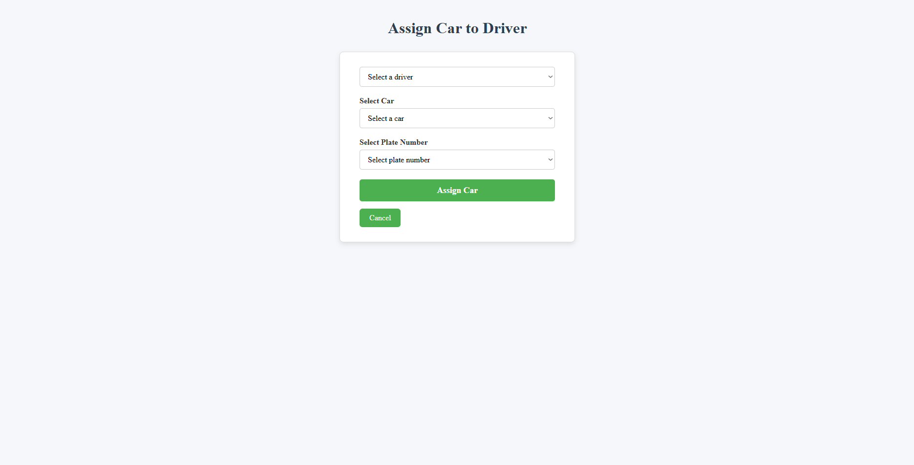
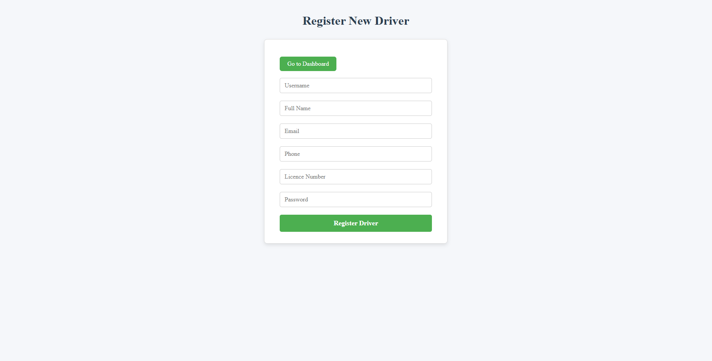
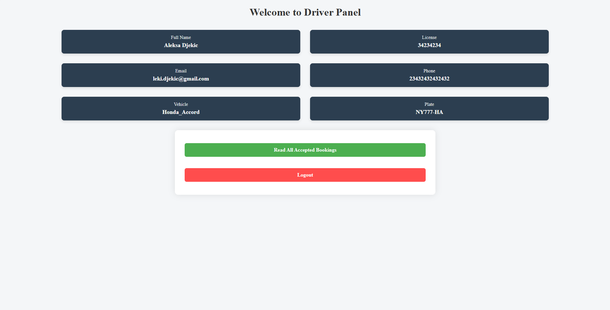

 # <h1 style="font-size: 36px; margin: 0;">Taxi Booking Web Application 🚖 </h1>

A web-based taxi booking platform developed using the Spring Framework. This application facilitates users in booking taxis online and provides drivers with tools to manage their rides efficiently.

---

- [Features](#features-)
- [Demo](#demo)
- [Screenshots](#screenshots)
- [Tech Stack](#tech-stack)
- [Usage](#usage)
- [Installation](#installation)
- [License](#license)
- [About Me](#about-me)


## Features 

- **User Registration & Authentication**: Secure sign-up and login functionalities for admins and drivers.
- **Taxi Booking**: Users can book rides by specifying pickup and drop-off locations.
- **Driver Management**: Drivers can view and manage their assigned bookings.
- **Admin Dashboard**: Administrators can oversee users, drivers, and bookings.
- **Responsive Design**: Ensures optimal viewing experience across various devices.
- **Vehicle Assignment**: Admin can assigns vehicles to drivers.

---

## Technologies 

--🚖 Ride Booking System (Select origin, destination, time)

--👥 Registration and Login (Admin / Driver)

--🛠️ Admin Dashboard (Manage users, rides, drivers)

--🔐 Authentication & Role-based Access

--🔔 Real-time notifications for new bookings and updates

--📧 Automated email confirmations for bookings

## Demo
<h2 align="center">All demo videos of web application will be soon available here!</h2>

## Screenshots

### Admin
<p align="center">
  
  
  
  
  
  
  
 
</p>

### Driver
<p align="center">
  
</p>
---

## Tech Stack

- **Java 17+**
- **Spring Boot**
- **PostGreSQL**
- **Thymeleaf / Bootstrap**
- **Maven** (for dependency management)
- **MailSender**
- **SockJS**
- **STOMP**
- **Spring WebSocket** 

---

## Usage

- Login as driver or admin
- Book rides with pickup/dropoff info
- Admin can view and manage all users, drivers, and rides
- Monitor statistics via dashboard

---

## License

This project is open-source and available under the MIT License.

---

## Installation

```bash
# Clone the repository
git clone https://github.com/YourUsername/TaxiBooking.git

# Navigate into the project directory
cd TaxiBooking

# Open the project in your IDE (IntelliJ, Eclipse, or VS Code)

# Build and run the app
mvn spring-boot:run

